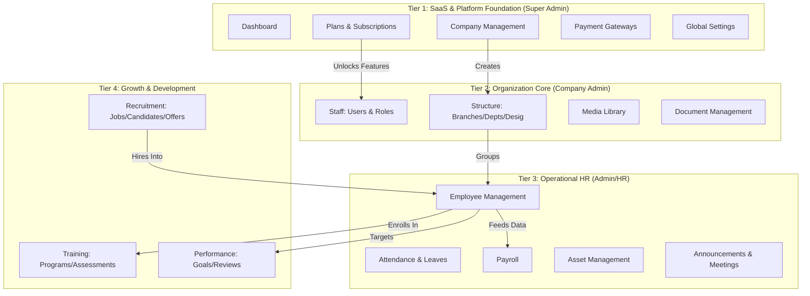

# PrototyzeHRM: Comprehensive System Workflow & Module Analysis

This document provides a deep-dive analysis of the PrototyzeHRM architecture, its 110+ functional models, and the operational lifecycle that drives the platform.

---

## 🏗️ 1. High-Level Architecture (Tiered View)

The system is organized into four hierarchical tiers, moving from the platform foundation to growth-oriented modules.

---

## ⚙️ 2. Functional Engines (Module Map)

We have identified **9 Core Engines** that group the 112 system models:

### 1. The SaaS Engine
*   **Models**: `Plan`, `PlanOrder`, `PlanRequest`, `PaymentSetting`, `Coupon`, `Currency`, `Referral`, `ReferralSetting`.
*   **Purpose**: Manages the multi-tenant business model, billing, and global platform configurations.

### 2. The ATS Engine (Recruitment)
*   **Models**: `JobRequisition`, `JobPosting`, `Candidate`, `Interview`, `InterviewFeedback`, `InterviewRound`, `Offer`, `CandidateOnboarding`.
*   **Purpose**: Handles the entire talent acquisition pipeline from vacancy to onboarding.

### 3. The Identity Engine
*   **Models**: `User`, `Role`, `Permission`, `IpRestriction`, `Webhook`.
*   **Purpose**: Governs authentication, authorization, and secure system access.

### 4. The Org Engine
*   **Models**: `Branch`, `Department`, `Designation`, `Category`.
*   **Purpose**: Defines the corporate structure and hierarchy.

### 5. The Personnel Engine
*   **Models**: `Employee`, `EmployeeDocument`, `HrDocument`, `DocumentAcknowledgment`, `AssetAssignment`.
*   **Purpose**: Central repository for all active staff data and company property tracking.

### 6. The Time Engine
*   **Models**: `Shift`, `AttendanceRecord`, `AttendancePolicy`, `LeaveApplication`, `LeaveBalance`, `Holiday`.
*   **Purpose**: Manages schedules, real-time attendance logging, and time-off tracking.

### 7. The Payroll Engine
*   **Models**: `SalaryComponent`, `EmployeeSalary`, `PayrollRun`, `PayrollEntry`, `Payslip`, `PayoutRequest`.
*   **Purpose**: Automated calculation and disbursement of salaries based on time logs and contract terms.

### 8. The Retention Engine (Performance)
*   **Models**: `EmployeeGoal`, `PerformanceIndicator`, `ReviewCycle`, `EmployeeReview`, `TrainingProgram`, `TrainingSession`, `TrainingAssessment`.
*   **Purpose**: Focuses on professional development, OKR tracking, and skill improvement.

### 9. The Event & Compliance Engine
*   **Models**: `Announcement`, `Award`, `Promotion`, `Transfer`, `Complaint`, `Warning`, `Resignation`, `Termination`, `Trip`.
*   **Purpose**: Manages internal communication, staff movements, and disciplinary/legal compliance.

---

## 🔄 3. "How it Works" (Operational Flow)

### The Recruitment-to-Payroll Lifecycle
1.  **Approval**: A manager creates a `JobRequisition`.
2.  **Sourcing**: Once approved, a `JobPosting` is published. Applicants become `Candidates`.
3.  **Selection**: Candidates move through `Interviews` and receive an `Offer`.
4.  **Activation**: Acceptance triggers `CandidateOnboarding`, which creates the `Employee` profile.
5.  **Operation**: The employee logs `AttendanceRecords` daily.
6.  **Fulfillment**: At the end of the month, the `PayrollRun` engine processes these logs into a `Payslip`.

---

## 📜 4. Project Stats
*   **Total Models**: 112
*   **Core Architecture**: Laravel 12 + React 19 (Inertia.js)
*   **Design System**: Radix UI + Tailwind CSS v4.0
